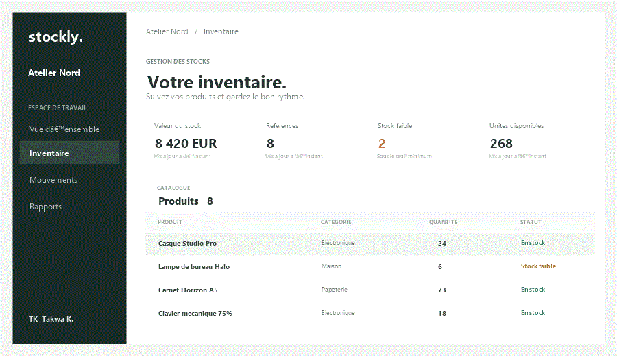
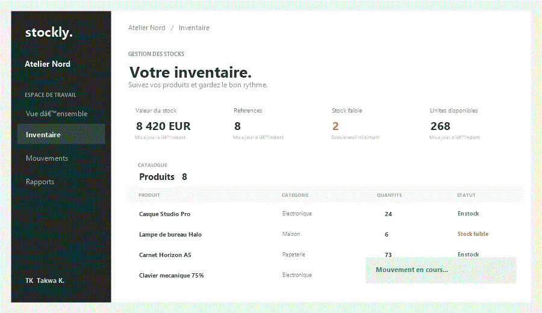

# Stockly

Application de gestion de stock avec une interface React, une API Python (FastAPI) et une base de données SQLite.

## Aperçu animé

Ces GIFs illustrent les principaux écrans et actions de Stockly :

| Inventaire | Mouvement de stock |
| --- | --- |
|  |  |

## Fonctionnalités

- Tableau de bord avec valeur du stock, références, unités et alertes de réapprovisionnement.
- Recherche et filtres par disponibilité et catégorie.
- Création, modification et suppression de produits.
- Enregistrement des entrées et sorties de stock, avec contrôle des quantités disponibles.
- Historique des mouvements et journalisation dans SQLite.
- Données de démonstration ajoutées automatiquement au premier démarrage.

## Prérequis

- Node.js 18 ou plus récent et npm.
- Python 3.10 ou plus récent.

## Installation et démarrage

À partir de la racine du projet, ouvrez deux terminaux.

### 1. API Python

Sous Windows PowerShell :

```powershell
py -m venv .venv
.\.venv\Scripts\Activate.ps1
pip install -r backend/requirements.txt
python -m uvicorn backend.main:app --reload
```

Sous macOS ou Linux :

```bash
python3 -m venv .venv
source .venv/bin/activate
pip install -r backend/requirements.txt
python -m uvicorn backend.main:app --reload
```

L'API est disponible à l'adresse `http://localhost:8000`. Sa documentation interactive est accessible sur `http://localhost:8000/docs`.

La base `backend/inventory.db` est créée automatiquement au démarrage à partir de `backend/schema.sql`. Ce fichier SQL définit les tables `products` et `movements`, leurs contraintes et les données initiales de démonstration.

### 2. Interface React

Dans le deuxième terminal, à la racine du projet :

```bash
npm install
npm run dev
```

Ouvrez `http://localhost:5173` dans votre navigateur. Le frontend utilise par défaut l'API à `http://localhost:8000/api`.

Pour configurer une autre URL d'API, définissez `VITE_API_URL` dans l'environnement avant de démarrer Vite, par exemple :

```powershell
$env:VITE_API_URL = "http://localhost:8000/api"
npm run dev
```

## Routes de l'API

| Méthode | Route | Description |
| --- | --- | --- |
| `GET` | `/api/health` | Vérifier que l'API fonctionne |
| `GET` | `/api/products` | Lister les produits; accepte le paramètre `search` |
| `POST` | `/api/products` | Créer un produit |
| `PUT` | `/api/products/{product_id}` | Modifier un produit |
| `DELETE` | `/api/products/{product_id}` | Supprimer un produit |
| `GET` | `/api/movements` | Lister les mouvements; accepte le paramètre `limit` |
| `POST` | `/api/movements` | Enregistrer une entrée ou une sortie de stock |

### Exemple : créer un produit

```json
{
  "name": "Clavier mécanique",
  "sku": "ELE-1001",
  "category": "Électronique",
  "quantity": 12,
  "min_quantity": 4,
  "unit_price": 79.9
}
```

### Exemple : enregistrer une entrée de stock

```json
{
  "product_id": "ID_DU_PRODUIT",
  "movement_type": "in",
  "quantity": 5,
  "note": "Réception fournisseur"
}
```

`movement_type` accepte `in` pour une entrée et `out` pour une sortie. Une sortie supérieure au stock disponible est refusée.

## Build de production

```bash
npm run build
npm run preview
```

## Structure

```text
backend/
  main.py          API FastAPI et accès à SQLite
  requirements.txt Dépendances Python
  schema.sql       Schéma et données de démonstration
src/
  App.jsx          Interface et interactions React
  main.jsx         Point d'entrée React
  styles.css       Styles responsive
index.html         Document HTML de Vite
```
